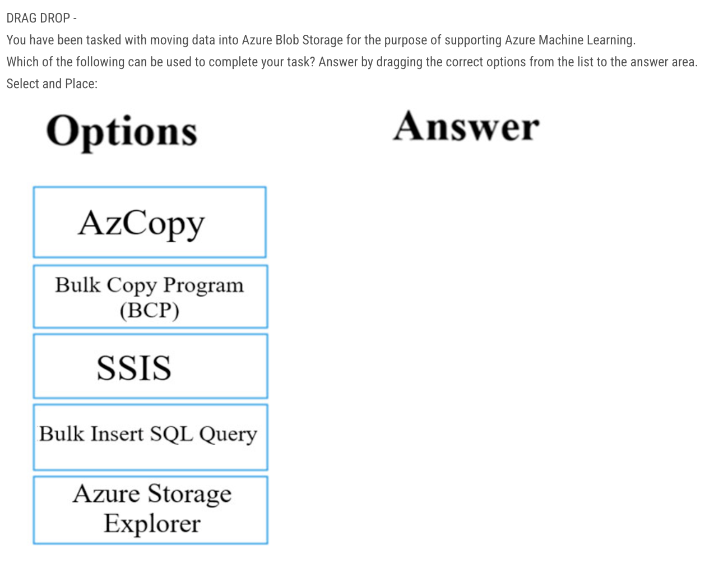
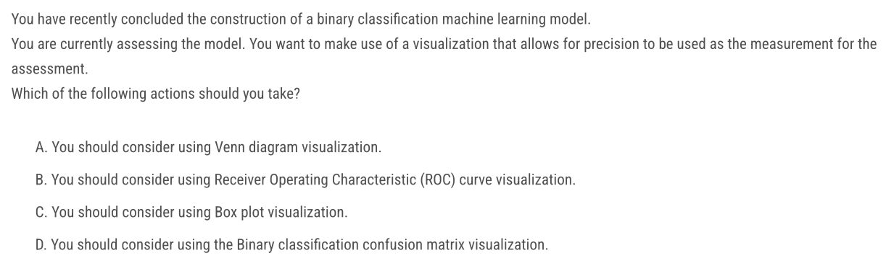
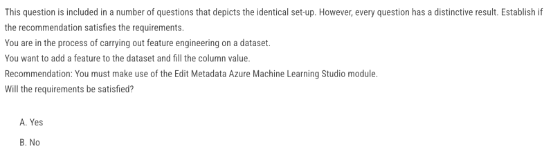
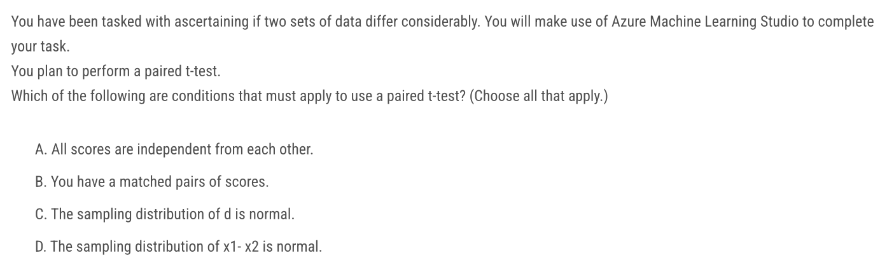

[TOC]

### Question 1


Ans: B, C, E
Reference: https://docs.docker.com/desktop/install/windows-install/#system-requirements

#### Docker on Windows

WSL 2 backend

------

- WSL version 1.1.3.0 or later.
- Windows 11 64-bit: Home or Pro version 21H2 or higher, or Enterprise or Education version 21H2 or higher.
- Windows 10 64-bit:
  - We recommend Home or Pro 22H2 (build 19045) or higher, or Enterprise or Education 22H2 (build 19045) or higher.
  - Minimum required is Home or Pro 21H2 (build 19044) or higher, or Enterprise or Education 21H2 (build 19044) or higher.
- Turn on the WSL 2 feature on Windows. For detailed instructions, refer to the [Microsoft documentation](https://docs.microsoft.com/en-us/windows/wsl/install-win10).
- The following hardware prerequisites are required to successfully run WSL 2 on Windows 10 or Windows 11:
  - **64-bit** processor with [Second Level Address Translation (SLAT)](https://en.wikipedia.org/wiki/Second_Level_Address_Translation)
  - **4GB** system RAM
  - Enable **hardware virtualization** in **BIOS**. For more information, see [Virtualization](https://docs.docker.com/desktop/troubleshoot/topics/#virtualization).

### Question 2


Ans: C

A DLVM is a pre-configured environment for deep learning using GPU instances.

#### DLVM, CUDA

The DLVM image is typically used on cloud platforms or local machines equipped with NVIDIA GPUs. Deep Learning Virtual Machine	是一个预配置的虚拟机映像，专门用于支持深度学习任务和工作流程。通常会预先安装并配置一系列常见的深度学习框架、库和工具，同时也会包含GPU和相关的GPU计算库，以便加速深度学习模型的训练和推理。

CUDA 是 NVIDIA 提供的用于利用 GPU 进行通用目的计算的平台和编程模型。DLVM 提供的虚拟机映像通常会预先安装 CUDA 工具包，以便用户可以利用 CUDA 技术在虚拟机上进行深度学习模型的训练和推理。

### Question 3


Ans: C

Reference:

https://ec-europa.github.io/digit-dataplatform/blocks/bb_azure_data_science_vm/

https://caffe.berkeleyvision.org/installation.html

https://techcommunity.microsoft.com/t5/educator-developer-blog/now-available-on-azure-marketplace-ubuntu-data-science-virtual/ba-p/378482

Prior to installing, have a glance through this guide and take note of the details for your platform. We install and run Caffe on Ubuntu 16.04–12.04, OS X 10.11–10.8, and through Docker and AWS. The official Makefile and `Makefile.config` build are complemented by a [community CMake build](https://caffe.berkeleyvision.org/installation.html#cmake-build).

The Linux DSVM comes with Linux Ubuntu 18.04 and the following deep learning and machine learning tools:

- Caffe and Caffe2

In addition to all the data science tools you love, you now have a choice of deep learning tools (CNTK, Tensorflow, MxNet, Caffe/Caffe2, Torch, Theano, Keras, NVidia Digits) on the Ubuntu version.

### Question 4


Ans: No

Reference: https://medium.com/@aneesha161994/azure-dp-100-part-7-azure-data-science-related-services-66314f281c3d

While a Geo AI Data Science Virtual Machine (Geo-DSVM) Windows edition might be a good choice for geographic data processing and analysis, it does not necessarily meet the requirement for GPU processing for the machine learning model and a PostgreSQL database.

A more appropriate recommendation would be to use a Data Science Virtual Machine (DSVM) with GPU support. This would ensure that the virtual machine has the necessary tools for machine learning, including PostgreSQL for database management, and also provides GPU capabilities for accelerated processing required by the model.

### Question 5


Ans: No

Reference: https://medium.com/@aneesha161994/azure-dp-100-part-7-azure-data-science-related-services-66314f281c3d

The recommendation to use a Deep Learning Virtual Machine (DLVM) Windows edition is not suitable for the given requirements because it is designed for Windows-based deep learning tasks and does not support GPU processing for PostgreSQL databases. Instead, a suitable virtual machine for this task would be one that supports GPU processing and has the necessary tools and libraries for machine learning and PostgreSQL database management. One such option is the Data Science Virtual Machine (DSVM), which is available for both Windows and Linux operating systems and has support for GPU processing and machine learning tools, including TensorFlow, PyTorch, and scikit-learn.

### Question 6


Ans: No

Reference: https://learn.microsoft.com/en-us/azure/machine-learning/data-science-virtual-machine/tools-included?view=azureml-api-2#build-deep-learning

|                                                              |                             |                             |                             |                                                              |
| :----------------------------------------------------------- | :-------------------------: | :-------------------------: | :-------------------------: | :----------------------------------------------------------: |
| Tool                                                         |  Windows Server 2019 DSVM   |  Windows Server 2022 DSVM   |      Ubuntu 20.04 DSVM      |                         Usage notes                          |
| [CUDA, cuDNN, NVIDIA Driver](https://developer.nvidia.com/cuda-toolkit) |              ✅              |              ✅              |              ✅              | [CUDA, cuDNN, NVIDIA Driver on the DSVM](https://learn.microsoft.com/en-us/azure/machine-learning/data-science-virtual-machine/dsvm-tools-deep-learning-frameworks?view=azureml-api-2#cuda-cudnn-nvidia-driver) |
| [Horovod](https://github.com/horovod/horovod)                |              ❌              |              ❌              |              ✅              | [Horovod on the DSVM](https://learn.microsoft.com/en-us/azure/machine-learning/data-science-virtual-machine/dsvm-tools-deep-learning-frameworks?view=azureml-api-2#horovod) |
| [NVidia System Management Interface (nvidia-smi)](https://developer.nvidia.com/nvidia-system-management-interface) |              ✅              |              ✅              |              ✅              | [nvidia-smi on the DSVM](https://learn.microsoft.com/en-us/azure/machine-learning/data-science-virtual-machine/dsvm-tools-deep-learning-frameworks?view=azureml-api-2#nvidia-system-management-interface-nvidia-smi) |
| [PyTorch](https://pytorch.org/)                              |              ✅              |              ✅              |              ✅              | [PyTorch on the DSVM](https://learn.microsoft.com/en-us/azure/machine-learning/data-science-virtual-machine/dsvm-tools-deep-learning-frameworks?view=azureml-api-2#pytorch) |
| [TensorFlow](https://www.tensorflow.org/)                    |              ✅              |              ✅              |              ✅              | [TensorFlow on the DSVM](https://learn.microsoft.com/en-us/azure/machine-learning/data-science-virtual-machine/dsvm-tools-deep-learning-frameworks?view=azureml-api-2#tensorflow) |
| Integration with [Azure Machine Learning](https://azure.microsoft.com/services/machine-learning/) (Python) |   ✅ (Python SDK, samples)   |   ✅ (Python SDK, samples)   | ✅ (Python SDK,CLI, samples) | [Azure Machine Learning SDK](https://learn.microsoft.com/en-us/azure/machine-learning/data-science-virtual-machine/dsvm-tools-data-science?view=azureml-api-2#azure-machine-learning-sdk-for-python) |
| [XGBoost](https://github.com/dmlc/xgboost)                   |      ✅ (CUDA support)       |      ✅ (CUDA support)       |      ✅ (CUDA support)       | [XGBoost on the DSVM](https://learn.microsoft.com/en-us/azure/machine-learning/data-science-virtual-machine/dsvm-tools-data-science?view=azureml-api-2#xgboost) |
| [Vowpal Wabbit](https://github.com/JohnLangford/vowpal_wabbit) |              ✅              |              ✅              |              ✅              | [Vowpal Wabbit on the DSVM](https://learn.microsoft.com/en-us/azure/machine-learning/data-science-virtual-machine/dsvm-tools-data-science?view=azureml-api-2#vowpal-wabbit) |
| [Weka](https://www.cs.waikato.ac.nz/ml/weka/)                |              ❌              |              ❌              |              ❌              |                                                              |
| LightGBM                                                     |              ❌              |              ❌              |    ✅ (GPU, MPI support)     |                                                              |
| H2O                                                          |              ❌              |              ❌              |              ✅              |                                                              |
| CatBoost                                                     |              ❌              |              ❌              |              ✅              |                                                              |
| Intel MKL                                                    |              ❌              |              ❌              |              ✅              |                                                              |
| OpenCV                                                       |              ❌              |              ❌              |              ✅              |                                                              |
| Dlib                                                         |              ❌              |              ❌              |              ✅              |                                                              |
| Docker                                                       | ✅ (Windows containers only) | ✅ (Windows containers only) |              ✅              |                                                              |
| Nccl                                                         |              ❌              |              ❌              |              ✅              |                                                              |
| Rattle                                                       |              ❌              |              ❌              |              ❌              |                                                              |
| PostgreSQL                                                   |              ❌              |              ❌              |              ✅              |                                                              |
| ONNX Runtime                                                 |              ❌              |              ❌              |              ✅              |                                                              |

可以看出只有ubuntu版本的才支持PostgreSQL。

### Question 7



Ans: AzCopy, SSIS, Azure Storage Explorer

Reference: https://stackoverflow.com/questions/59449188/copy-millions-of-files-form-root-azstorage-blob-to-subfolders

AzCopy is a command-line utility that you can use to copy blobs or files to or from a storage account.

The bulk copy program utility (bcp) bulk copies data between an instance of Microsoft SQL Server and a data file in a user-specified format.

SQL Server Integration Services (SSIS) is a platform for building enterprise-level data integration and data transformations solutions. Use Integration Services to solve complex business problems.

Bulk Insert SQL Query imports a data file into a database table or view in a user-specified format in SQL Server.

Azure Storage Explorer can upload, download, and manage Azure Storage blobs, files, queues, and tables, as well as Azure Data Lake Storage entities and Azure managed disks. Configure storage permissions and access controls, tiers, and rules.

Read doc: [Move data to and from Azure Blob storage](https://learn.microsoft.com/en-us/azure/machine-learning/team-data-science-process/move-azure-blob)

The following articles describe how to move data to and from Azure Blob storage using different technologies.

- [Azure Storage-Explorer](https://learn.microsoft.com/en-us/azure/machine-learning/team-data-science-process/move-data-to-azure-blob-using-azure-storage-explorer)
- [AzCopy](https://learn.microsoft.com/azure/storage/common/storage-use-azcopy-v10)
- [Python-SDK](https://learn.microsoft.com/en-us/azure/machine-learning/team-data-science-process/move-data-to-azure-blob-using-python) (Others: [.NET, Java, Node.js, Python, Go, PHP, Ruby.](https://learn.microsoft.com/en-us/azure/storage/blobs/storage-blobs-overview))
- [SSIS](https://learn.microsoft.com/en-us/azure/machine-learning/team-data-science-process/move-data-to-azure-blob-using-ssis)

### Question 8


Ans: ARFF

Reference: https://azuremarketplace.microsoft.com/en-us/marketplace/apps/cloud-infrastructure-services.weka-windows-2019?tab=overview

https://learn.microsoft.com/en-us/azure/machine-learning/component-reference/enter-data-manually?view=azureml-api-2

https://learn.microsoft.com/en-us/azure/machine-learning/migrate-overview?view=azureml-api-1

Weka is a collection of machine learning algorithms for data mining tasks.  It contains tools for data preparation, classification, regression, clustering, association rules mining, and visualization.  Weka can be used to build machine learning pipelines, train classifiers, and run evaluations without having to write a single line of code. 

For **DataFormat**, select one of the following options. These options determine how the data that you provide should be parsed. The requirements for each format differ greatly, so be sure to read the related topics.

- **ARFF**: Attribute-relation file format used by Weka.
- **CSV**: Comma-separated values format. For more information, see [Convert to CSV](https://learn.microsoft.com/en-us/azure/machine-learning/component-reference/convert-to-csv?view=azureml-api-2).
- **SVMLight**: Format used by Vowpal Wabbit and other machine learning frameworks.
- **TSV**: Tab-separated values format.

ARFF文件由两个主要部分组成：属性（Attributes）和数据（Data）。

```sql
@relation fruits

@attribute color {red, yellow, green}
@attribute shape {round, oval}
@attribute is_ripe {yes, no}

@data
red, round, yes
yellow, oval, no
green, round, yes
```

| Category                | Studio (classic) module                                      | Replacement designer component                    |
| :---------------------- | :----------------------------------------------------------- | :------------------------------------------------ |
| Data input and output   | - Enter data manually - Export data - Import data - Load trained model - Unpack zipped datasets | - Enter data manually - Export data - Import data |
| Data format conversions | - Convert to CSV - Convert to dataset - Convert to ARFF - Convert to SVMLight - Convert to TSV | - Convert to CSV - Convert to dataset             |

Use the **Convert to ARFF** module in Azure Machine Learning Studio, to convert datasets and results in Azure Machine Learning to the attribute-relation file format used by the **Weka** toolset. This format is known as ARFF.
The ARFF data specification for Weka supports multiple machine learning tasks, including data preprocessing, classification, and feature selection. In this format, data is organized by entities and their attributes, and is contained in a single text file.

### Question 9


Ans: B

我们设计一个deep learning model，来识别语言。我们应该使用哪种DSVM？

Rattle是R中一个用于数据挖掘的图形交互界面（GUI），可快捷处理常见的数据挖掘问题，从数据的整理到模型的评价，Rattle给出了完整的解决方案。

TensorFlow是深度学习领域最受欢迎和广泛使用的框架之一，被用于各种应用领域，包括图像识别、自然语言处理、语音识别、推荐系统等。因此，此处我们想要识别文本就可以使用Tensorflow。

Theano是一个用于数学表达式计算的开源Python库，特别是用于定义、优化和求值多维数组的数学表达式。

Chainer是一个用于深度学习的开源Python库，通过动态计算图来定义神经网络模型，这使得用户能够以一种直观的方式构建和调试模型。

### Question 10


Ans: B

在进行交叉验证时，通常选择k=5 或 k=10，但实际上你可以根据数据集的特点选择任意数量的折叠。该句还提到了训练/测试/验证（train/test/validate）的概念，它们本质上也是数据集的三个不同部分，但可能会在交叉验证中进行多次划分。

### Question 11


Ans: A

k-fold交叉验证中k参数的通常选择值为10。这个值通常被使用，因为它提供了高折叠次数(导致较小的偏差，但较大的方差)和低折叠次数(导致较大的偏差，但较小的方差)之间的良好平衡。

### Question 12


Ans: A

Reference: https://learn.microsoft.com/en-us/azure/machine-learning/component-reference/split-data?view=azureml-api-2

Use the **Split Data component** to divide a dataset into two distinct sets. This component is useful when you need to separate data into training and testing sets. You can also customize the way that data is divided. Some options support randomization of data. Others are tailored for a certain data type or model type.

### Question 13


Ans: C

Reference: https://learn.microsoft.com/en-us/azure/machine-learning/component-reference/import-data?view=azureml-api-2

There are two ways you can import data into the designer: **Azure Machine Learning datasets** - Register datasets in Azure Machine Learning to enable advanced features that help you manage your data. **Import Data component** - Use the Import Data component to directly access data from **online** data sources. 

The instruction explicitly says that there is no dataset registered for the csv file. D (add dataset object) presupposes that such a dataset exists and thus is False. C (import data module) remains as the only viable option. 

Adding the Import Data object to the pipeline in Azure Machine Learning designer is the most efficient way to ingest data from a CSV file published on a website. This action allows you to directly access and import the data into the pipeline with minimal administrative effort, eliminating the need for manual data conversion or copying. The Import Data object supports various data sources, including web URLs, making it ideal for this task.

Use the **Import Data component** to load data into a machine learning pipeline from existing cloud data services. The **Import Data component** support read data from following sources:

- URL via HTTP
- Azure cloud storages through Datastores) Azure Blob Container
  - Azure File Share
  - Azure Data Lake
  - Azure Data Lake Gen2
  - Azure SQL Database
  - Azure PostgreSQL

### Question 14


Ans: No 

We simply dont have enough information about the dataset to know if Median substitution will work, so the answer is No.

使用Azure Machine Learning Studio中的Clean Missing Data模块和Replace with median选项可以帮助检测和修复数据集中的空值和缺失值。“用中位数替换”选项用相应列的中位数替换数据集中缺失的值。这种输入缺失值的方法可以在保持数据的总体分布和避免引入极值之间提供良好的平衡。通过使用Clean Missing Data模块和Replace with median选项，您可以帮助确保您的数据集已被清理，并准备好用于创建满足要求的机器学习模型。

对于**连续型**特征，可以使用该特征的**均值或中位数**来填补缺失值。这种方法简单直接，能够保持数据的整体分布特征。对于分类型特征，可以使用该特征的**众数**（出现频率最高的值）来填补缺失值。

### Question 15


Ans: A

Reference: https://learn.microsoft.com/en-us/azure/machine-learning/component-reference/clean-missing-data?view=azureml-api-2

For **Cleaning Mode**, select one of the following options for replacing or removing missing values:

- **Custom substitution value**: Use this option to specify a placeholder value (such as a 0 or NA) that applies to all missing values. The value that you specify as a replacement must be compatible with the data type of the column.

- **Replace with mean**: Calculates the column mean and uses the mean as the replacement value for each missing value in the column.

  Applies only to columns that have Integer, Double, or Boolean data types.

- **Replace with median**: Calculates the column median value, and uses the median value as the replacement for any missing value in the column.

  Applies only to columns that have Integer or Double data types.

- **Replace with mode**: Calculates the mode for the column, and uses the mode as the replacement value for every missing value in the column.

  Applies to columns that have Integer, Double, Boolean, or Categorical data types.

- **Remove entire row**: Completely removes any row in the dataset that has one or more missing values. This is useful if the missing value can be considered **randomly missing**.

- **Remove entire column**: Completely removes any column in the dataset that has one or more missing values.

由于缺乏有关所讨论的数据集的信息，使用自定义替换将是有利的。这样可以更好地控制选择与数据一致的适当替代品，从而获得有利的结果。因此，答案是肯定的。

### Question 16


Ans: B

### Question 17


Ans: B

Reference: https://learn.microsoft.com/en-us/previous-versions/azure/machine-learning/studio-module-reference/convert-to-indicator-values

这个操作等价于one-hot encoding，该模块的目的是将包含分类值的列转换为一系列二进制指示符列，这些列可以更轻松地用作机器学习模型中的特征。

### Question 18


Ans: A

Reference: https://learn.microsoft.com/en-us/azure/machine-learning/component-reference/smote?view=azureml-api-2

题目要改善数据集中低发生率案例的数量。在数据集中，有些类别或情况可能发生的频率较低，而这些低频事件可能在某些机器学习任务中具有重要性。SMOTE 组件可以来增加用于机器学习的数据集中代表性不足的案例数量。与简单地复制现有案例相比，SMOTE 是增加罕见案例数量的更好方法。

合成少数过采样技术 (SMOTE) 是一种统计技术，用于以平衡的方式增加数据集中的案例数量。该组件的工作原理是根据您作为输入提供的现有少数案例生成新实例。 SMOTE 的这种实现不会*改变*多数情况的数量。

新实例不仅仅是现有少数案例的复制品。相反，该算法对每个目标类及其最近邻的*特征空间*进行采样。然后，该算法生成新的示例，将目标案例的特征与其邻居的特征相结合。这种方法增加了每个类别可用的功能，并使样本更加通用。

### Question 19


Ans: B

Reference: https://learn.microsoft.com/en-us/azure/databricks/visualizations/visualization-types

The box plot can be used to display outliers.

条形图：表示指标随时间的变化或者显示比例。

折线图：显示一个或多个指标随时间的变化。

面积图：结合了折线图和条形图，显示一个或者多个组的数值如何随着第二个变量（通常是时间）的进展而变化。

饼状图：显示指标之间的比例，不适用于传达时间序列数据。

直方图：绘制给定值在数据集中出现的频率，帮助我们了解数据集的值是否聚集在少量范围内或者更加分散。

热图：用颜色可视化数值数据，用较暖的颜色表示高值，用较冷的颜色表示低值。

散点图：显示两个数值变量之间的关系，显示数值在不同组之间的差异。

箱型图：可视化数值的分布，可以按列别分组，比较值的范围。

### Question 20


Ans: C

Azure Notebooks are accessible by any device that can connect to the internet. The other options require installation of additional software, which is not permitted in this scenario.

Azure笔记本是一项免费服务，提供托管在云中的Jupyter笔记本。该服务允许用户在浏览器中编写和执行Python(以及其他语言)代码，而无需在本地机器上进行任何配置或安装软件。这使得它成为学习者没有管理员权限来安装软件并且不能直接访问Azure订阅的场景的理想解决方案。Azure笔记本支持Python中的数据可视化库，如Matplotlib, Seaborn或Plotly，使其适合旨在使学习者熟悉数据可视化创建的实践培训。

### Question 21


Ans: A

Reference: https://learn.microsoft.com/en-us/previous-versions/azure/machine-learning/studio-module-reference/clean-missing-data

对于**清洁模式**，选择以下选项之一来替换或删除缺失值：

- **Replace using MICE**：对于每个缺失值，此选项分配一个新值，该新值是使用统计文献中描述的方法计算的，例如“使用链式方程的多元插补”或“通过链式方程的多重插补”。使用 *多重插补方法*，在填充缺失值之前，使用数据中的其他变量有条件地对每个缺失数据的变量进行建模。相反，在*单一插补方法*（例如用列平均值替换缺失值）中，对数据进行单次传递以确定填充值。

  所有插补方法都会引入一些误差或偏差，但多重插补可以更好地模拟数据生成过程和数据的概率分布。

  有关处理缺失值的方法的一般介绍，请参阅[缺失数据：现有技术。谢弗和格雷厄姆，2002 年](https://www.academia.edu/1045565/Missing_Data_Our_View_of_the_State_of_the_Art)。

   警告

  此选项不能应用于完全空的列。必须删除此类列或按原样传递到输出。

- **自定义替换值**：使用此选项指定适用于所有缺失值的占位符值（例如 0 或 NA）。您指定作为替换的值必须与列的数据类型兼容。

- **替换为平均值**：计算列平均值并使用该平均值作为列中每个缺失值的替换值。

  仅适用于具有整数、双精度或布尔数据类型的列。有关详细信息，请参阅[技术说明部分。](https://learn.microsoft.com/en-us/previous-versions/azure/machine-learning/studio-module-reference/clean-missing-data#bkmk_TechNotes)

- **替换为中值**：计算列中值，并使用中值替换列中任何缺失值。

  仅适用于具有 Integer 或 Double 数据类型的列。有关详细信息，请参阅[技术说明部分。](https://learn.microsoft.com/en-us/previous-versions/azure/machine-learning/studio-module-reference/clean-missing-data#bkmk_TechNotes)

- **替换为众数**：计算列的众数，并使用该众数作为列中每个缺失值的替换值。

  适用于具有整数、双精度、布尔值或分类数据类型的列。有关详细信息，请参阅[技术说明部分。](https://learn.microsoft.com/en-us/previous-versions/azure/machine-learning/studio-module-reference/clean-missing-data#bkmk_TechNotes)

- **删除整行**：完全删除数据集中具有一个或多个缺失值的任何行。如果缺失值可以被视为随机缺失，则这非常有用。

- **删除整列**：完全删除数据集中任何具有一个或多个缺失值的列。

- **使用概率 PCA 替换**：使用线性模型替换缺失值，该模型分析列之间的相关性并估计数据的低维近似值，从中重建完整数据。底层的降维是主成分分析 (PCA) 的概率形式，它实现了 Tipping 和 Bishop 在《皇家统计学会杂志》系列 B 21(3)、611-622 中提出的模型的变体。

  与其他选项（例如使用链式方程的多重插补 (MICE)）相比，此选项的优点是不需要为每列应用预测变量。相反，它近似整个数据集的协方差。因此，它可能为许多列中缺少值的数据集提供更好的性能。

  Compared to other options, such as Multiple Imputation using Chained Equations (MICE), this option has the advantage of **not requiring the application of predictors for each column**. Instead, it approximates the covariance for the full dataset. Therefore, it might offer better performance for datasets that have missing values in many columns.

  该方法的主要局限性在于它将分类列扩展为数值指标并计算结果数据的密集协方差矩阵。它也没有针对稀疏表示进行优化。由于这些原因，具有大量列和/或大型分类域（数万个）的数据集由于空间消耗过高而不受支持。

### Question 22



Ans: D

Reference:

Venn diagram visualization: 维恩图使用重叠的圆圈来说明概念、想法、类别或组之间的相似性、差异和关系。组之间的相似性由圆圈的重叠部分表示，而差异由圆圈的非重叠部分表示。

ROC curve visualization: 接收者操作特征 (ROC) 曲线是**说明二元分类模型性能的**图形表示。它显示了不同分类阈值下真阳性率（敏感性）和假阳性率（1 - 特异性）之间的权衡。ROC 曲线提供了模型在不同分类阈值下的性能的直观表示。完美的分类器将具有一条穿过图左上角的 ROC 曲线，表明所有阈值都具有高灵敏度 (TPR) 和低误报率 (FPR)。曲线越接近左上角，模型的性能越好。

Binary classification confusion matrix visualization: 混淆矩阵，也称为误差矩阵，是通过显示真阳性 (TP)、真阴性 (TN)、假阳性 (FP) 和假阴性 (FN) 的计数来总结分类模型性能的表格。 ）预测。它提供了模型性能的详细视图，特别是对于二元分类问题。

混淆矩阵允许您通过评估正确和错误预测之间的平衡来评估分类模型的性能。从混淆矩阵中，可以得出各种评估指标，例如准确度、精确度、召回率（敏感性）、特异性和 F1 分数。

### Question 23


Ans: B

### Question 24


Ans: 1, 5

Reference: https://learn.microsoft.com/en-us/azure/machine-learning/component-reference/poisson-regression?view=azureml-api-2

仅当您尝试预测的值符合以下条件时，才应使用此组件来创建回归模型：

- 响应变量服从[泊松分布](https://en.wikipedia.org/wiki/Poisson_distribution)。
- 计数不能为负数。如果您尝试将其与负面标签一起使用，该方法将彻底失败。
- 泊松分布是一种离散分布；因此，对于非整数使用此方法没有意义。

### Question 25


Ans: B

The typical use for grouping categorical values is to merge multiple string values into a single new level.

Azure Machine Learning Studio中的“Group Categorical Values”模块旨在减少分类数据的粒度。它将数据中不经常出现的分类值组合在一起，这对于可能不能很好地处理高基数分类数据的模型是有益的。这个模块对于管理和简化分类特性很有用，但并不直接处理添加新特性和填充其值的任务。

让我们举一个简单的例子来说明：

假设我们有一个包含用户信息的数据集，其中包括一个名为 "Education" 的分类特征，表示用户的教育程度。在该特征中，有一些取值非常常见，如 "High School"、"Bachelor's Degree" 和 "Master's Degree"，但也有一些取值非常罕见，如 "Ph.D." 和 "Post-Doctoral"。

在这种情况下，"Group Categorical Values" 模块可以将那些罕见的教育程度分类值合并成一个通用的类别，如 "Other"。这样做可以将不经常出现的分类值归并到一个更广泛的类别中，从而减少了分类特征的数量，简化了模型的复杂性。

### Question 26


Ans: B

Azure Machine Learning Studio中的“Join Data”模块允许您基于一个或多个通用键合并两个数据集。当您希望使用来自其他来源的附加信息来扩展现有数据集时，这一点特别有用。例如，如果您有一个销售事务数据集和另一个产品信息数据集，您可以使用“Join Data”模块通过连接两个数据集中的产品ID列，向销售事务数据集添加产品详细信息(一个新功能)。

### Question 27



Ans:  A

Reference: https://learn.microsoft.com/en-us/azure/machine-learning/component-reference/edit-metadata?view=azureml-api-2

使用编辑元数据组件可以更改与数据集中的列关联的元数据。使用编辑元数据组件后，数据集的值和数据类型将发生变化。

典型的元数据更改可能包括：

- 将布尔值或数字列视为分类值。
- 指示哪一列包含**类**标签或包含要分类或预测的值。
- 将列标记为特征。
- 将日期/时间值更改为数值，反之亦然。
- 重命名列。

当您需要修改列的定义时，可以随时使用“编辑元数据”，通常是为了满足下游组件的要求。例如，某些组件仅适用于特定数据类型或需要列上的标志，例如`IsFeature`或`IsCategorical`。

### Question 28



Ans: BC

#### T-test

t检验（t-test）是一种用于比较两个群体之间平均值差异是否显著的统计方法。它可以用于确定两个群体的均值是否显著不同，例如，两种不同治疗方法对疾病的疗效是否有显著差异，或者两个产品的平均销售量是否有显著差异。

